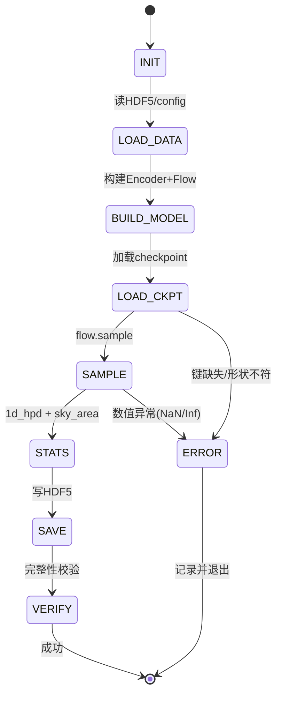

# SAD（Software Architecture Design）— 条件归一化流快速空间定位模块

> 本文档遵循 `SAD_Template.md` 的 10 章结构，描述本项目核心代码模块的边界、接口与内部设计，覆盖 CNF 训练（flows_labeltranform.py）、快速推断（test_sky_area_overall_updated.py）、后验统计（nsf_posterior_statistics.py）与结果诊断（pp_plot 脚本）。为保持文档聚焦，本文档以**训练与推断链路**为主模块展开，仿真/PTMCMC 作为其上游依赖在边界章节说明。

## 文档信息

| 字段 | 内容 |
| --- | --- |
| 模块名称 | MBHB 条件归一化流快速空间定位（训练 + 推断 + 统计） |
| 对应PRD版本 | requirement_bbh.md v1.0 |
| SAD版本 | v1.0 |
| 负责人 | — |
| 开发语言 | Python >=3.11 |
| 运行环境 | Linux + CUDA GPU，conda env `bbhx`，GSL 2.7.1 |
| 关联代码目录 | flow_label_renorm/、flow_inference/、flow_result_checks/ |
| 状态 | Draft |

---

# 1. 模型生成约束（Prompt Meta-instructions）

## 1.1 LLM角色定义

```
你是一名引力波数据分析与深度学习软件架构专家。

你的任务：
- 根据本文档生成/维护符合设计要求的 Python 代码。
- 不允许修改 HDF5 dataset 名与 params 列序（参数索引契约）。
- 不允许新增未定义的参数 kind（linear/log_linear/power/angle_2pi/angle_pi）。
- 不允许隐藏异常——所有异常按第 4.4 节异常路由处理。
- 所有公共函数必须包含 Docstring 与单元测试。
```

## 1.2 LLM必须遵守规则

* Python 版本：`Python >= 3.11`
* 编码规范：PEP8；Type Hint 完整；公共函数 Docstring。
* 禁止行为：

```
禁止：
1. 修改 HDF5 dataset 名（noisysignal/params/post/true/names/skyarea/event_stats）
2. 修改 checkpoint 的 state 键名（embedding_state/flow_state/scaler_state/metadata）
3. 修改 PARAMS_INDEX=(0 7 8 6 1 2 9 10 11) 与评估参数序 "0 7 8 1 2"
4. 使用未声明第三方库
```

## 1.3 Agent Coding约束

| 项目 | 要求 |
| --- | --- |
| 生成代码范围 | 仅限项目根目录 `{ROOT}` 内 |
| 允许修改文件 | flow_label_renorm/、flow_inference/、flow_result_checks/ 下脚本 |
| 禁止修改文件 | 波形/似然/PSD 物理内核（signal_simulation_hm/PhenomHM/） |
| 依赖安装方式 | requirements.txt / conda env `bbhx` |
| 测试入口 | pytest |

---

# 2. 模块边界与依赖条件（Boundary & Dependency）

## 2.1 功能定位

本模块解决：**给定白化应变 → 条件流抽样后验 → 量化参数 HPD 与天空可信面积**。

不负责：波形物理生成、探测器噪声理论建模、PTMCMC 采样算法实现。

上下游关系：

```
上游（输入）:  packing_2channels_hpc.py（HDF5 数据）→ 训练模块
               ptmcmc_toymodel.py（基线真值，非运行时依赖）
下游（输出）:  pp_plot 脚本（后验校准）
```

## 2.2 输入依赖

| 依赖 | 版本 | 用途 |
| --- | --- | --- |
| torch | CUDA | 模型/流训练推断 |
| glasflow | CouplingNSF | 神经样条流 |
| h5py | — | 数据读写 |
| numpy / scipy / pandas | — | 数值/统计 |
| healpy | nside=512 | 天空像素化 |
| bilby | Result | P-P 诊断 |
| sklearn | DBSCAN | 天空模态聚类 |

## 2.3 外部文档引用

```
关联PRD: requirement_bbh.md
章节:    7.3 阶段三（训练）、7.4 阶段四（推断）、7.5 阶段五（诊断）
关联接口:
  HDF5 dataset: noisysignal / params / post / true / names / skyarea / event_stats
  参数契约:     pipeline_dataflow_bbh.md（索引约定 A/B）
```

## 2.4 运行边界

单进程运行（推断）；训练可多 GPU/AMP。

生命周期：

```
加载配置 → 构建模型 → 加载 checkpoint → 读数据 → 抽样 → 统计 → 落盘 HDF5 → 退出
```

---

# 3. 接口设计（Interface Design）

## 3.1 输入接口

**训练输入**（flows_labeltranform.py）：

| 来源 | 格式 | 契约 |
| --- | --- | --- |
| HDF5 数据文件 | `noisysignal`(N,2,4320), `params`(N,12) | read_h5_data |
| param_9-dim_override.json | JSON | 9 维 kind/lo/hi/power |
| 命令行 args | argparse | 见 run-training 脚本 |

**推断输入**（test_sky_area_overall_updated.py）：

| 来源 | 格式 | 契约 |
| --- | --- | --- |
| checkpoint | .pth | embedding_state/flow_state/scaler_state/metadata |
| 测试 HDF5 | 同训练 schema | _load_data |
| 命令行 args | argparse | sky_nsides/coverages/params/num_samples |

**参数定义 JSON Schema（param_9-dim_override.json）**：

```json
{
  "0": {"name": "Mc",  "kind": "log_linear", "lo": 200000.0, "hi": 1000000.0},
  "7": {"name": "lon", "kind": "angle_2pi",  "lo": 0.0,     "hi": 6.2831853},
  "8": {"name": "lat", "kind": "linear",     "lo": -1.5708, "hi": 1.5708}
}
```

字段说明：

| 字段 | 类型 | 必填 | 说明 |
| --- | --- | --- | --- |
| name | string | Y | 参数名 |
| kind | string | Y | linear/log_linear/power/angle_2pi/angle_pi |
| lo / hi | number | Y | 物理范围 |
| power | number | N | kind=power 时的幂指数 |

## 3.2 输出接口

**推断输出 HDF5**：

| dataset | shape | 说明 |
| --- | --- | --- |
| post | (Ne, Ns, Np) | 后验样本 |
| true | (Ne, Np) | 真值 |
| names | (Np,) | 参数名（bytes） |
| skyarea | — | 天空面积结果 |
| event_stats | — | 每事件统计（1d_hpd / sky_stats） |
| sampling_time_sec | — | 抽样耗时 |

关键字段路径：`event_stats['sky_stats']['union_by_nside']['512']['0.9000']`（A90）。

## 3.3 数据格式定义

禁止裸 `data = xxx`；必须结构化为命名 dataset / dict。示例（事件统计）：

```python
event_stats = {
  "1d_hpd": {"Mc": (lo, hi), ...},
  "sky_stats": {"union_by_nside": {"512": {"0.6827": a68, "0.9000": a90}}}
}
```

---

# 4. 内部设计（Internal Design）

## 4.1 模块结构

```
flows_labeltranform.py          # 训练主程序
  class NumpyDataset
  class InputStatsNet           # (禁用)
  build_models()                # EmbeddingComb + CouplingNSF
  train_one_epoch() / eval_one_epoch()
  run_diagnostics()             # 潜空间高斯一致性
  profile_flops_one_or_more_steps()
  main()

test_sky_area_overall_updated.py  # 推断主程序
  inspect_checkpoint() / load_checkpoint_strict()
  build_dim_report()
  generate_samples_for_batch()
  _load_data() / _build_models() / _save_samples()
  main()

nsf_posterior_statistics.py       # 统计内核
  wrap_to_pi() / wrap_to_0_2pi() / clip_lat_to_halfpi()
  lonlat_to_unitvec()
  shortest_interval_1d()
  summarize_sky_modes_with_area()
  compute_mode_hpd_area_healpix(_probsum)
  compute_parameter_statistics()
  verify_hdf5_file_completeness()
```

## 4.2 内部函数定义

| 函数 | 输入 | 输出 | 说明 |
| --- | --- | --- | --- |
| FlexibleIndexParamTransform.forward_with_logdet | theta | z, logdet | 标签有界变换 + 雅可比 |
| EmbeddingComb.forward | (B,2,4320) | (B,128) | 提取条件潜变量 |
| CouplingNSF.sample | cond(B,128) | theta(B,Np) | 抽样（内部 sigmoid→u_to_theta） |
| generate_samples_for_batch | batch | samples | 批量抽样 |
| compute_parameter_statistics | samples | dict | 1D HPD（自适应 knn_k） |
| summarize_sky_modes_with_area | lon,lat | dict | DBSCAN 聚类 + 可信面积 |
| verify_hdf5_file_completeness | h5 path | bool | 完整性校验 |

## 4.3 状态机设计



## 4.4 异常路由设计

| 异常 | 来源 | 处理 |
| --- | --- | --- |
| checkpoint 键缺失/形状不符 | load_checkpoint_strict | 报错并列出差异，中止 |
| 后验含 NaN/Inf | 抽样 | 诊断记录（pp_plot 安全过滤） |
| 常数后验样本 | 抽样退化 | pp_plot validate_data 告警 |
| 注入值超出后验范围 | 统计 | 记录 INFO，不中断 |
| HDF5 缺失 dataset | 读写 | verify 报错定位缺失项 |
| 标签索引越界 | params 列序错 | 依据索引契约断言，中止 |

## 4.5 核心流程伪代码

```python
def train():
    data = read_h5_data(h5_path)                    # noisysignal, params
    transform = FlexibleIndexParamTransform(param_defs)
    z, logdet = transform.forward_with_logdet(theta) # theta -> logit(u)
    embedding = EmbeddingComb(...)                   # 128 维条件潜变量
    flow = CouplingNSF(n_inputs=9, n_conditional=128, ...)
    for epoch in range(EPOCHS):
        loss = -mean(flow.log_prob(z, cond=embedding(x)) + logdet)
        backward(); step(); cosine_anneal(); early_stop()

def infer():
    load_checkpoint_strict(ckpt)
    for batch in test_loader:
        theta = generate_samples_for_batch(batch)   # flow.sample -> sigmoid -> u_to_theta
        stats = compute_parameter_statistics(theta) # 1d_hpd
        sky   = summarize_sky_modes_with_area(theta[:,0], theta[:,1])  # lon,lat
    save_hdf5(post, true, names, skyarea, event_stats)
    verify_hdf5_file_completeness(out)
```

---

# 5. 数据模型设计（Data Model）

## 5.1 存储影响

| 对象 | 字段 | 操作 |
| --- | --- | --- |
| HDF5 训练文件 | noisysignal / params | read |
| HDF5 结果文件 | post / true / names / skyarea / event_stats | write |
| checkpoint | embedding_state / flow_state / scaler_state / metadata | write(read) |

## 5.2 内部对象模型

```python
class ParamDef:                      # data_norm_flexible.py
    name: str
    lo: float
    hi: float
    power: float = 3.0
    kind: str                        # linear/log_linear/power/angle_2pi/angle_pi

class FlexibleIndexParamTransform:
    sel_idx: list[int]               # 训练子集索引
    def forward_with_logdet(theta) -> (z, logdet)
    def inverse_with_logdet(z) -> (theta, logdet)
```

---

# 6. 单元测试设计（Unit Test Design）

> 支持 Agent 自动生成测试。

## 6.1 Mock边界约束

Agent 运行环境无真实 HDF5 大数据、无 GPU、无完整波形内核，因此必须 Mock 外部资源。

| 对象 | 真实环境 | 测试Mock |
| --- | --- | --- |
| HDF5 数据 | 真实打包文件 | 内存构造小批量 numpy |
| 波形/PSD | 物理内核 | Fake 波形函数 |
| GPU/CUDA | 真实 GPU | device='cpu' |
| bilby Result | 完整后验 | 手写 pandas DataFrame |

## 6.2 Mock数据定义

输入（角度包裹测试）：

```python
theta = np.array([[-0.1, 6.5, 0.5]])   # lon 越界 -> wrap 到 [0,2pi)
```

异常（标签变换 NaN）：

```python
theta_bad = np.array([[np.nan, 0.5, 1.2]])
```

## 6.3 测试用例

| 编号 | 场景 | 输入 | 期望结果 |
| --- | --- | --- | --- |
| TC001 | 角度包裹 | lon=-0.1/6.5 | wrap 到 [0,2pi) 且 logdet 正确 |
| TC002 | 标签正逆变换 | z=logit(u) | inverse(forward(theta))approxtheta |
| TC003 | 雅可比修正 | 任意 theta | logdet 有限且符号正确 |
| TC004 | 后验完整性 | 含 NaN 后验 | verify 返回 False 并定位 |
| TC005 | checkpoint 键缺失 | 删 metadata | load_checkpoint_strict 报错 |
| TC006 | 天空面积 | 单模态样本 | A90 面积单调随覆盖率增 |
| TC007 | PP 图常数样本 | 全同后验 | validate_data 告警不崩溃 |

## 6.4 Agent自动测试要求

```
pytest:
  tests/test_label_transform.py
  tests/test_sky_statistics.py
  tests/test_hdf5_verify.py

覆盖率: >=80%

必须覆盖: 1.正常流程 2.边界条件(角度/越界) 3.异常路径(NaN/键缺失) 4.状态迁移(加载→抽样→落盘)
```

---

# 7. 安全设计（Security）

## 7.1 权限控制

- 仅科学计算环境内调用，无外部网络暴露。
- 写路径限制在项目目录内，禁止覆盖原始训练数据（读后复制）。

## 7.2 数据安全

- 结果 HDF5 采用只读原始文件 + 独立输出目录，避免覆盖。
- 真值/后验无敏感字段；Checkpoint 版本化命名防止误覆盖。

---

# 8. 性能指标（Performance）

| 指标 | 目标 |
| --- | --- |
| 单事件推断抽样 | 秒级（相对 PTMCMC 数小时/数十万步，加速数个数量级） |
| 训练吞吐 | AMP 混合精度，Batch=2048 |
| 后验样本量 | 单事件 10000 条 |
| HEALPix 分辨率 | nside=512 |
| 结果落盘 | 完整 HDF5（post/true/names/skyarea/event_stats） |

---

# 9. 发布与运维（Deployment）

## 9.1 部署方式

```
训练: bash flow_label_renorm/run-training-flows-labeltranform.sh
推断: bash flow_inference/run-test-generate-eval-samples-all-statistics.sh
诊断: python pp_plot_diagnoistic.py --hdf5_file <result.hdf5>
```

## 9.2 日志规范

```
INFO:  正常流程（数据加载、checkpoint、抽样耗时）
WARN:  可恢复异常（注入值超出后验范围、常数样本）
ERROR: 业务失败（checkpoint 键缺失、HDF5 缺失、NaN 抽样）
```

---

# 10. Review Checklist

提交 SAD 前必须确认：

* [ ] PRD 章节已引用（requirement_bbh.md §7）
* [ ] 输入输出接口完整（HDF5 schema + JSON schema）
* [ ] JSON 格式完整（param_9-dim_override.json）
* [ ] 状态机完成（加载→抽样→落盘）
* [ ] 异常路径完成（NaN/键缺失/越界）
* [ ] Mock 边界完成（CPU/内存 numpy）
* [ ] Unit Test 完成（标签变换/天空统计/完整性）
* [ ] Agent 可以自动生成测试
* [ ] Agent 可以根据 SAD 生成代码
* [ ] 参数索引契约与 pipeline_dataflow_bbh.md 一致
